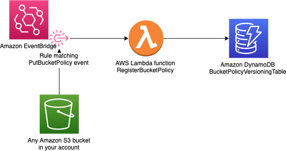
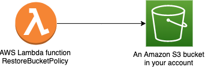

# Amazon S3 Bucket Policies Versioning

This sample project provides you with the capability of easily versioning Amazon S3 bucket policies using a serverless architecture.
Each time a bucket policy is applied on an S3 bucket, the policy gets recorded in a DynamoDB table with an id (md5 of the policy json document).

You can restore a previous version of a bucket policy by invoking an AWS Lambda function and passing the id of the policy to be restored to the function.

# Requirements

- Because this is an [AWS SAM](https://docs.aws.amazon.com/serverless-application-model/index.html) (Serverless Application Model) project, you will need to [install the sam cli.](https://docs.aws.amazon.com/serverless-application-model/latest/developerguide/serverless-sam-cli-install.html)
- Install Docker

# Example of install using Python pip tool

    # Clone this repository and change directory into the project you just cloned
    git clone therepositoryrl
    cd s3-bucket-policy-versioning

    # Create a virtual environment and activate it
    python -m venv venv
    source ./venv/bin/activate .

    # Install SAM CLI
    pip install aws-sam-cli

    # Export the AWS profile you want to use
    export AWS_PROFILE=your_aws_profile

    # Configure the region of your choice
    export AWS_DEFAULT_REGION=eu-west-1

    #Build the SAM Project and deploy it
    sam build --use-container; sam deploy --guided
    
# The deployed CloudFormation Stack resources

The *sam deploy* command will deploy the following CloudFormation stack:

- An Amazon DynamoDB table to store the different versions of bucket policies
- An AWS EventBridge event rule to catch *PuBucketPolicy* api calls and trigger the register Lambda function.
- An AWS Lambda function to persist the bucket policy (*RegisterBucketPolicy*)
- An AWS Lambda function to restore a bucket policy  (*RestoreBucketPolicy*)

# Persist Amazon S3 bucket policies into an Amazon DynamoDB table

Below, the architecture of the solution.

# Amazon DynamoDB table

| BucketName               | Timestamp                                   | BucketPolicy                   | BucketPolicyHash                | UserIdentity                                            |
|--------------------------|---------------------------------------------|--------------------------------|---------------------------------|---------------------------------------------------------|
| *The name of the bucket* | *The timestamp of the PuBucketPolicy event* | *The bucket policy* | *The hash of the bucket policy* | *The user identity that called the PutBucketPolicy api* |

# Restore a bucket policy

If you want to restore a bucket policy you will have to run the *RestoreBucketPolicy* Lambda function with the following *event* data:

    {
        "BucketPolicyHash": "hash_code"
    }

where *hash_code* comes from the column **BucketPolicyHash** of the Amazon DynamoDB table.

# Security

See [CONTRIBUTING](CONTRIBUTING.md#security-issue-notifications) for more information.

# License

This library is licensed under the MIT-0 License. See the LICENSE file.

